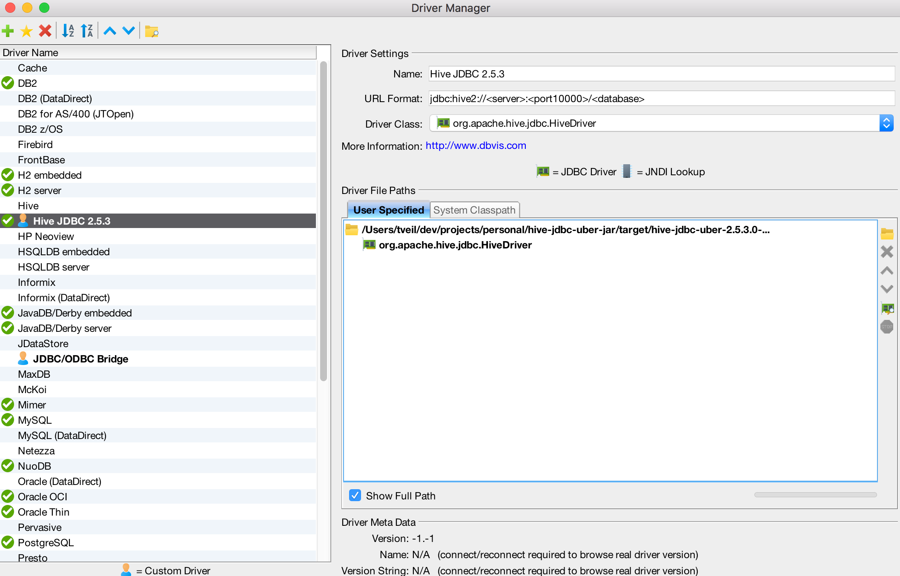
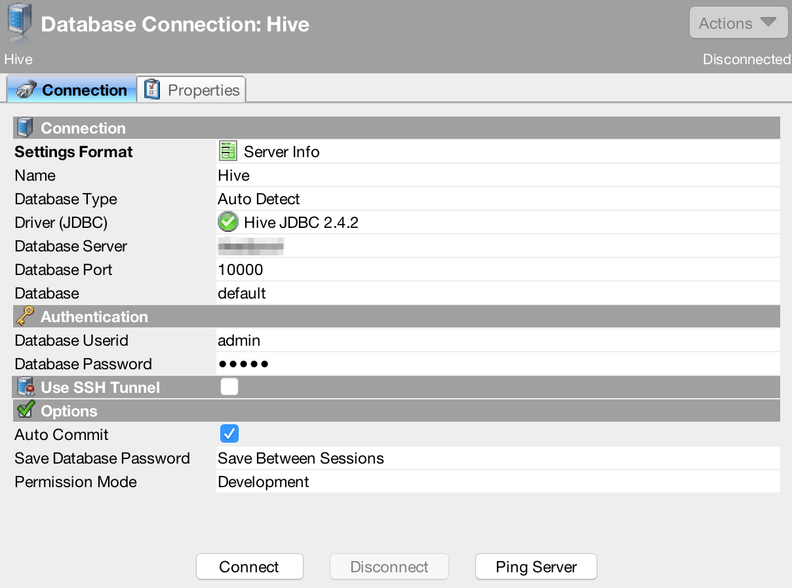
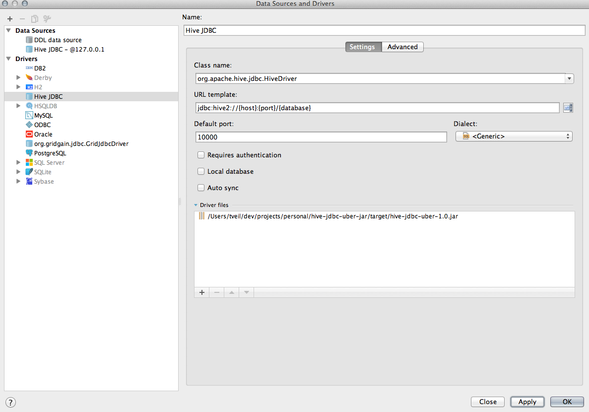
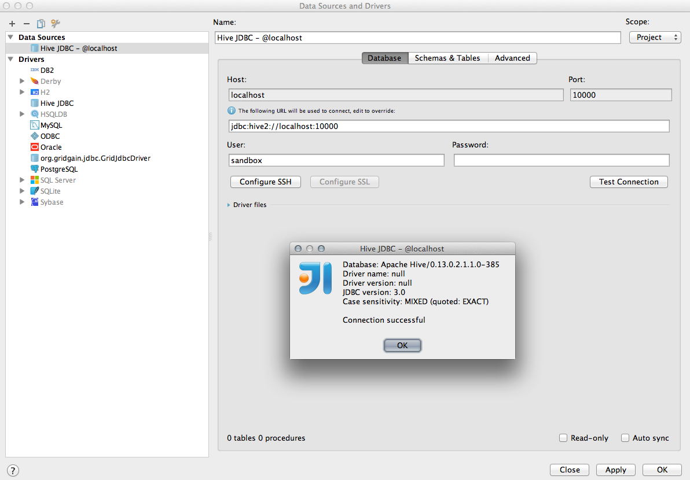
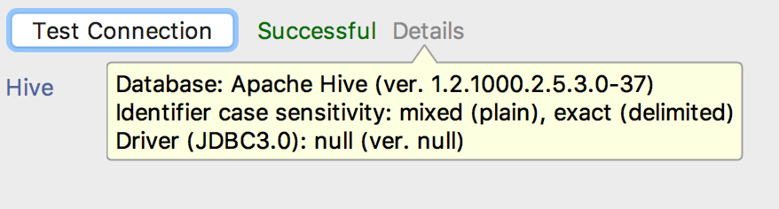
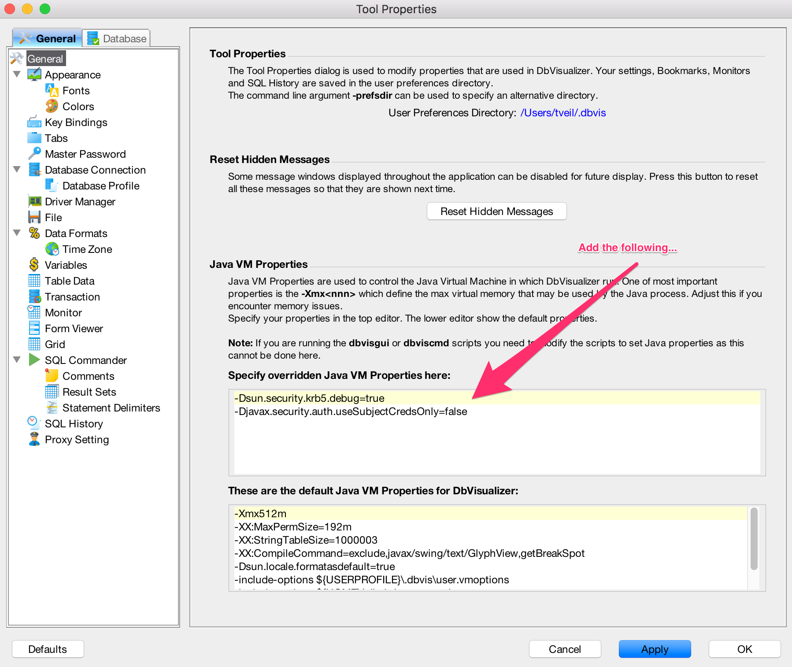
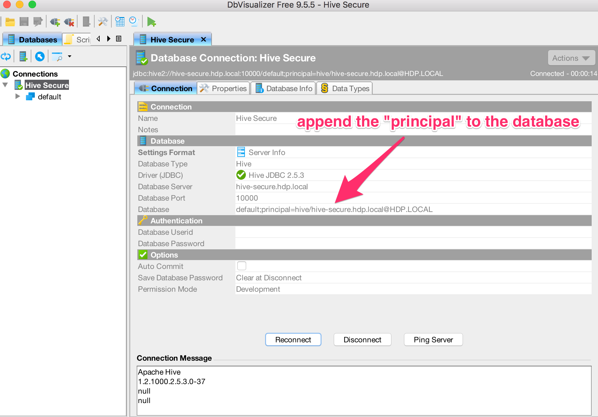
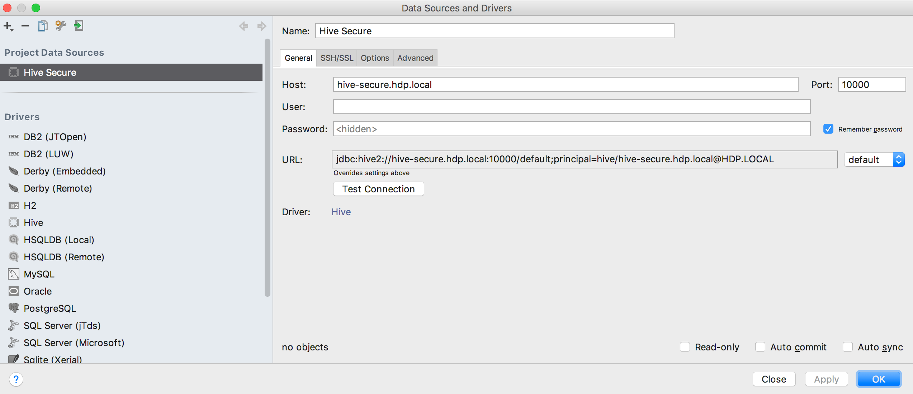
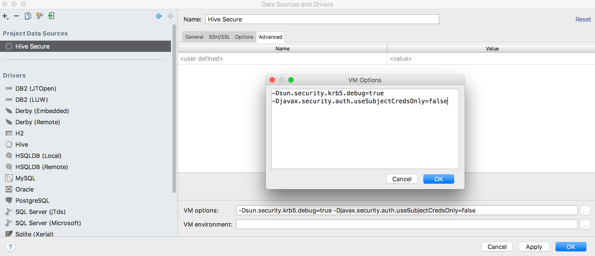

# Overview
Sometimes you want to connect your favorite database query or visualization tool to Hive. I've found that this can be quite cumbersome, typically requiring you to copy jars from the Hadoop cluster to some place locally that can be read by your tool. Recent versions of Hive include a "standalone" jar, but even this does not include all required dependencies.  The goal of this simple maven project is to easily pull the required jars into a single place locally and create an "uber" or "standalone" jar that can be referenced by any JDBC compliant tool.

Please note this jar works with both kerberized and non-kerberized clusters.  Configuring tools to work against kerberized clusters is typically more involved and requires an understanding of Kerberos.  A full explanation of configuring Kerberos is outside the scope of this project.

You can download the latest binaries from the releases page:  https://github.com/timveil/hive-jdbc-uber-jar/releases

* Updated for HDP 2.6.1.0 - 06/08/17  __LATEST__
* Resolved issue with Zookeeper discovery - 01/27/17
* Added support kerberized clusters - 12/19/16
* Updated for HDP 2.5.3.0 - 12/01/16
* Updated for HDP 2.5.0.0 - 09/12/16

## Note about Kerberos and the workaround
When connecting to a kerberized cluster, ultimately the class `org.apache.hadoop.util.VersionInfo` is loaded.  This class attempts to load a file called `*-version-info.properties` in an effort to determine the current Hadoop version.  To do this, the following snippet of code is called:

```java
  protected VersionInfo(String component) {
    info = new Properties();
    String versionInfoFile = component + "-version-info.properties";
    InputStream is = null;
    try {
      is = Thread.currentThread().getContextClassLoader().getResourceAsStream(versionInfoFile);
      if (is == null) {
        throw new IOException("Resource not found");
      }
      info.load(is);
    } catch (IOException ex) {
      LogFactory.getLog(getClass()).warn("Could not read '" +
          versionInfoFile + "', " + ex.toString(), ex);
    } finally {
      IOUtils.closeStream(is);
    }
  }
```

When using DataGrip, this code executes successfully, but with DbVisualizer and other tools like SQuirreLSQL, the properties file is not found and errors are generated downstream.  For example, the following error is often encountered if the properties file fails to load.

```
java.lang.RuntimeException: Illegal Hadoop Version: Unknown (expected A.B.* format)
   at org.apache.hadoop.hive.shims.ShimLoader.getMajorVersion(ShimLoader.java:168)
   at org.apache.hadoop.hive.shims.ShimLoader.loadShims(ShimLoader.java:143)
   at org.apache.hadoop.hive.shims.ShimLoader.getHadoopThriftAuthBridge(ShimLoader.java:129)
   at org.apache.hive.service.auth.KerberosSaslHelper.getKerberosTransport(KerberosSaslHelper.java:54)
   at org.apache.hive.jdbc.HiveConnection.createBinaryTransport(HiveConnection.java:414)
   at org.apache.hive.jdbc.HiveConnection.openTransport(HiveConnection.java:191)
   at org.apache.hive.jdbc.HiveConnection.<init>(HiveConnection.java:155)
   at org.apache.hive.jdbc.HiveDriver.connect(HiveDriver.java:105)
```

The trouble seems to be caused by the way `org.apache.hadoop.util.VersionInfo` attempts to load the properties file using `Thread.currentThread().getContextClassLoader()`.  I suspect the difference in behavior between tools boils down to how each chooses to load the "uber" jar.  In any event, I have overwritten `org.apache.hadoop.util.VersionInfo` in this project to use a more robust approach for loading the properties file.

```java
// Original code uses Thread.currentThread().getContextClassLoader() which does not
// contain the properties file in DbVisualizer or SQuirreLSQL

is = Thread.currentThread().getContextClassLoader().getResourceAsStream(versionInfoFile);

```

```java
// My updated code first checks the Thread.currentThread().getContextClassLoader(), but if no InputStream is found
// then checks this.getClass().getClassLoader(). In my testing, this eliminated the above error in
// both DbVisualizer and SQuirrelSQL.  The behavior of DataGrip was unchanged.

is = Thread.currentThread().getContextClassLoader().getResourceAsStream(versionInfoFile);
if (is == null) {
    LogFactory.getLog(getClass()).warn("Could not find '" +
            versionInfoFile + "' in Thread.currentThread().getContextClassLoader()."
            + "  Trying this.getClass().getClassLoader()");
    is = this.getClass().getClassLoader().getResourceAsStream(versionInfoFile);
}
```

This updated code is inserted into the final "uber" jar and replaces the copy of `org.apache.hadoop.util.VersionInfo` originally found in `hadoop-common.jar`.

# Non-kerberized Setup

## DbVisualizer (as of version 9.5.5)
Below is an example configuration using [DbVisualizer](http://www.dbvis.com/):

1. Open the Diver Manager dialog ("Tools" > "Driver Manager...") and hit the "Create a new driver" icon.

2. Fill in the information as seen below.  For the "Driver File Paths" you are pointing to `hive-jdbc-uber-x.jar`.

    ```
    jdbc:hive2://<server>:<port10000>/<database>
    ```

    

3. Create a new connection ("Database" > "Create Database Connection") and fill out the details based on your cluster as seen below.

    

4. Hit the "Connect" button to test the connection.  You should see something like the following in the "Connection Message" text area if the connection is successful.

    ```fundamental
    Apache Hive
    1.2.1000.2.5.3.0-37
    null
    null
    ```

## JetBrains DataGrip (as of version 2016.3)
Below is an example configuration using JetBrains [DataGrip](https://www.jetbrains.com/datagrip/):

1. Under "File" > "Data Sources...", create a new Driver.

    ```
    jdbc:hive2://{host}:{port}/{database}[;<;,{:identifier}={:param}>]
    ```

    

2. Then create a new Project Data Source using the new Driver.

    

3. After creating the Project Data Source, test the connection.  You should see the following:

    

# Kerberized Setup
Connecting a JDBC tool to a kerberized cluster is a bit more complicated than connecting to a non-kerberized cluster.  Before getting started, ensure the following:

* The `krb5.conf` file on your workstation matches the one on your cluster
* You have a valid kerberos principal that can access the appropriate services your custer
* You can successfully `kinit` from your workstation against the realm specified in your `krb5.conf` file

    ```bash
    # for example, from my Mac, i execute the follwing command
    kinit -t /[path to my keytab]/tveil.keytab
    ```
* You have installed the [JCE](http://www.oracle.com/technetwork/java/javase/downloads/jce8-download-2133166.html) jars in the correct place.  The latest JCE jars have a modified date of `12/20/2013`.
  * In DbVisualizer go to "Help" > "About" > "System Properties" and look for the `java.home` entry.  This should point to the JRE used by the tool.  Make sure the updated JCE jars are the `lib/security` directory under this folder.
  * In DataGrip - todo  

## DbVisualizer (as of version 9.5.5)
Below is an example configuration using [DbVisualizer](http://www.dbvis.com/) against a kerberized cluster:

1. `kinit` with an appropriate principal and launch DbVisualizer

1. Open DbVisualizer preferences ("DbVisualizer" > "Preferences") and add the following properties.  DbVisualizer will need to be restarted after applying these changes.

    ```dosini
    # optional flag to help debug kerberos issues
    -Dsun.security.krb5.debug=true

    -Djavax.security.auth.useSubjectCredsOnly=false
    
    # Depending on your OS or Kerberos install, you may need to pass in the location of your krb5 configuration file.
    # On mac/linux this is often a krb5.conf file.  On windows, this is often a krb5.ini file.
    -Djava.security.krb5.conf="[path-to-kerberos-file]/krb5.ini"
    ```

    

1. Open the Diver Manager dialog ("Tools" > "Driver Manager...") and hit the "Create a new driver" icon.

1. Fill in the information as seen below.  For the "Driver File Paths" you are pointing to `hive-jdbc-uber-x.jar`.

    ```
    jdbc:hive2://<server>:<port10000>/<database>
    ```

    

1. Create a new connection ("Database" > "Create Database Connection") and fill out the details based on your cluster as seen below.  Please note that you must append the "principal" to the "database" parameter for kerberized connections.

    

1. Hit the "Connect" button to test the connection.  You should see something like the following in the "Connection Message" text area if the connection is successful.

    ```fundamental
    Apache Hive
    1.2.1000.2.5.3.0-37
    null
    null
    ```

## JetBrains DataGrip (as of version 2016.3)
Below is an example configuration using JetBrains [Data Grip](https://www.jetbrains.com/datagrip/) against a kerberized cluster:

1. `kinit` with an appropriate principal and launch DataGrip

2. Under "File" > "Data Sources...", create a new Driver.

    ```
    jdbc:hive2://{host}:{port}/{database}[;<;,{:identifier}={:param}>]
    ```

    

3. Then create a new Project Data Source using the new Driver.

    

    ```dosini
    # optional flag to help debug kerberos issues
    -Dsun.security.krb5.debug=true

    -Djavax.security.auth.useSubjectCredsOnly=false
    
    # Depending on your OS or Kerberos install, you may need to pass in the location of your krb5 configuration file.
    # On mac/linux this is often a krb5.conf file.  On windows, this is often a krb5.ini file.
    -Djava.security.krb5.conf="[path-to-kerberos-file]/krb5.ini"
    ```

    

4. After creating the Project Data Source, test the connection.  You should see the following:

    

# How to Build
To build locally, you must have Maven installed and properly configured.  After that it's as simple as running `mvn:package`.  A file called `hive-jdbc-uber-x.jar` will be created in your `target` directory.  The newly created jar will have the Hive JDBC driver as well as all required dependencies.

# Logging
All logging dependencies have been filtered and bridged with SLF4J in this jar and Log4J has been included as the logging implementation.  While no `log4j.properties` has been included in this jar, its fairly easy to configure Log4J and DbVisualizer to debug whats happening inside JDBC.  To setup Log4J in DbVisualizer, do the following.

1. Create a `log4j.properties` file and put it somewhere easy to remember find on your workstation.  Below is a very simple example.

```log4j
log4j.rootLogger=WARN, console

log4j.appender.console=org.apache.log4j.ConsoleAppender
log4j.appender.console.layout=org.apache.log4j.PatternLayout
log4j.appender.console.layout.ConversionPattern=%d{HH:mm:ss:SSS} %-5p [%c]: %m%n

log4j.logger.org.apache.hive=DEBUG
log4j.logger.org.apache.hadoop=DEBUG
log4j.logger.org.apache.thrift=DEBUG
```

2. Add the following JVM flag to DbVisualizer preferences (see "DbVisualizer" > "Preferences")

```dosini
-Dlog4j.configuration=file:[path to your log4j.properties file]/log4j.properties
```

You should now see driver logging in the DbVisualizer logs. 

If the configuration doesn't work or you elect not to provide a `log4j.properties` file reference, you will see the following messages in your DbVisualizer log.  You can ignore these warnings if you are not interested in the driver logs.

```
2017-08-09 17:24:39.750 INFO   786 [ExecutorRunner-pool-2-thread-1 - R.flush] log4j:WARN No appenders could be found for logger (org.apache.hive.jdbc.Utils).
2017-08-09 17:24:39.751 INFO   786 [ExecutorRunner-pool-2-thread-1 - R.flush] log4j:WARN Please initialize the log4j system properly.
2017-08-09 17:24:39.751 INFO   786 [ExecutorRunner-pool-2-thread-1 - R.flush] log4j:WARN See http://logging.apache.org/log4j/1.2/faq.html#noconfig for more info.
```